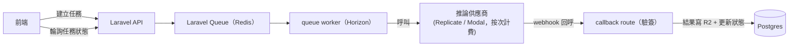

# SASD — Phase 3：AI 生成引擎與社群河道

> PawFit（爪搭）系統分析與設計文件
> 版本 0.1（草稿）｜2026-08-31｜狀態：規劃中（含多個 go/no-go 判斷點）
> 依賴：3A 線依賴 Phase 1＋2（素體版型）；3B 線僅依賴 Phase 1，可先於 Phase 2 上線

---

## 0. 定位

兩條線並行，彼此獨立可拆：

- **A 線（AI）**：把「任意設定圖 → 專屬紙娃娃」的承諾分階段兌現，取代 Phase 2「只能選官方素體」的限制。
- **B 線（社群）**：好友、發文、雙軌河道，讓穿搭圖有地方展示——這條線技術風險低，可先行。

兩線各自獨立上線：3B 只依賴 Phase 1（發圖庫圖即可成立，衣櫥穿搭圖是 Phase 2 上線後的加分）；3A 依賴 Phase 2 的素體版型，且 A1–A4 各以獨立 flag 分批啟用（`FEATURE_AI_CUTOUT`、`FEATURE_AI_SEGMENT`…），過不了 gate 的階永遠不開。全案獨立上線原則見 Phase 1 §0.1。

## 1. A 線：AI 生成引擎

### 1.1 對應 User Stories

US-6（極限容錯：轉正／補全）、US-7（拆件生成紙娃娃）——US-7 的 3D 生成部分屬 Phase 4。

### 1.2 能力階梯與 Go/No-Go

依難度與品質風險分四階，**每階有獨立判斷點，過不了就停在上一階**：

| 階 | 能力 | 技術路線 | Go/No-Go 條件 |
|---|---|---|---|
| A1 | 自動去背 | 成熟分割模型（如 BiRefNet 系列）走推論 API | 基本必過；成本每張 < US$0.01 |
| A2 | 半自動拆件 | SAM 類模型產生部件候選遮罩＋**前端手動修正 UI**（人機協作，不追求全自動） | 內測用戶 15 分鐘內能把一張標準立繪拆成可換裝紙娃娃，且願意做完 |
| A3 | 自訂紙娃娃對齊 | 拆件結果對齊 Phase 2 素體骨架錨點（縮放／位移／簡單網格變形），沿用槽位與 z-index 帶 → 商城服飾可直接套用 | 對齊後官方服飾試穿無明顯錯位（內測滿意度） |
| A4 | 轉正／視角補全 | 生成式 img2img（diffusion + 姿勢控制），**明確標示實驗性** | 產出保留原設定特徵的比例達內測門檻；否則永久擱置——寧缺勿濫，重繪失真會傷害「設定資料精準」的核心價值 |

### 1.3 功能需求

- FR-A1 上傳設定圖 → 一鍵去背，結果存為圖庫衍生檔。
- FR-A2 拆件工作台：AI 候選遮罩 → 用戶點選合併／分割／指派到槽位（頭／軀幹／尾…）→ 產出分層素材。
- FR-A3 自訂紙娃娃：分層素材對齊素體骨架，之後在衣櫥與官方素體同等使用；不相容的商城服飾按 Phase 2 機制自動過濾。
- FR-A4 每用戶 AI 配額（免費層每月 N 次，防成本失控），任務進度可查、失敗自動退還配額。

### 1.4 系統設計

- **不自架 GPU**。按次計費推論（Replicate／Modal 類），成本隨用量線性，配額兜底。
- 新表 `ai_jobs`：id, user_id, media_id, kind(a1/a2/a3/a4), status(pending/processing/done/failed), input/output jsonb, cost_cents, created_at。狀態機單向，webhook 需驗簽。
- 拆件工作台是**前端重投資**（Pixi 遮罩編輯），這是 A 線一半以上的工作量，估時要按前端專案算，不是「接個 API」。

## 2. B 線：社群與動態河道

### 2.1 對應 User Stories

US-2（無縫雙棲，Phase 1 已滿足）、US-17～19（標籤／NSFW 河道／標籤連動與河道）。

### 2.2 功能需求

- FR-B1 好友：以 Pawfit ID 或個人主頁送出邀請 → 接受制；封鎖／解除好友。
- FR-B2 啟用 `friends` 隱私值：獸設與圖檔隱私新增「限好友」（Phase 1 資料模型已預留）。
- FR-B3 發文：圖（圖庫圖或衣櫥匯出圖）＋文字；**母標籤繼承**——自動帶入獸設標籤，單次發文可增刪；credit 自動沿用圖檔的繪師標記。
- FR-B4 NSFW：發文強制標記（來源圖已標 NSFW 則鎖定不可改回 SFW）；河道嚴格執行 Phase 1 顯示矩陣。
- FR-B5 雙軌河道：`好友河道`（時間序）＋`探索河道`（公開貼文，標籤篩選＋時間序；**不做推薦演算法**，初期用戶量撐不起也不需要）。
- FR-B6 互動最小集：讚＋留言（一層，不做巢狀）；檢舉沿用；被封鎖者互不可見。

### 2.3 資料模型（新增表）

| 表 | 關鍵欄位 |
|---|---|
| friendships | user_a, user_b（正規化為 a<b）, status(pending/accepted), requested_by |
| blocks | blocker_id, blocked_id |
| posts | id, author_id, fursona_id, body, tags[], is_nsfw, visibility(public/friends), status |
| post_media | post_id, media_id, sort |
| post_likes / post_comments | 常規設計，comments 單層 |

- 河道查詢：cursor 分頁（created_at + id）；好友河道以 friendships join，探索河道以 `visibility=public` ＋ tags GIN index。用戶量到萬級前不需要 fan-out 架構，**先用最直白的查詢**。

### 2.4 治理量提醒

河道會把 NSFW 內容的能見度放大，檢舉量與審核負擔隨之上升。此 phase 需評估：檢舉自動優先排序（同目標多檢舉自動暫時降能見度）＋考慮引入第三方圖像審核 API 掃描紅線內容（成本列入預算）。

## 3. 里程碑

- **M1（B 線先行）**：好友＋friends 隱私＋發文與母標籤繼承。
- **M2**：雙軌河道＋互動＋治理強化。
- **M3（A 線）**：A1 去背上線 → A2 拆件工作台內測 → gate 評估。
- **M4**：A3 自訂紙娃娃接通衣櫥與商城；A4 僅在前三階全過後評估。

## 4. 風險

| # | 風險 | 對策 |
|---|---|---|
| R-1 | AI 成本失控 | 配額＋按次計費供應商＋任務級成本記帳（cost_cents） |
| R-2 | A2 拆件體驗太繁瑣，用戶不買單 | gate 條件明確（15 分鐘內完成且願意完成）；不過就停留在官方素體制 |
| R-3 | A4 重繪失真傷害信任 | 標示實驗性＋結果不自動覆蓋任何設定資料；寧可砍掉 |
| R-4 | 河道放大治理負擔 | 自動降能見度機制＋圖像審核 API 評估 |
| R-5 | 繪師社群對 AI 功能反彈（獸圈對生成式 AI 高度敏感） | 溝通定位：只處理「用戶自有設定圖的拆件與對齊」，A4 這類生成式重繪需原圖上傳者確認擁有權利；此點需在功能發布前有明確公開說明 |
