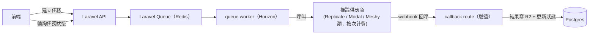

# SASD — Phase 5：AI 生成引擎

> PawFit（爪搭）系統分析與設計文件
> 版本 0.2（草稿）｜2026-09-11｜狀態：規劃中（全 phase 皆為 go/no-go，優先度最低）
> 上一份：`SASD-Phase4-3D與實體委託.md`
> 依賴：A1 僅 Phase 1；A2–A4 依賴 Phase 3 素體版型；X1 依賴 Phase 4 檢視器。**沒有任何 phase 依賴本 phase。**
> 變更紀錄：0.2 由舊版 Phase 3 的 A 線（AI）獨立成篇，並併入舊版 Phase 4 的 FR-X1「2D→3D 生成」；全案所有 AI 功能集中於此，排在最後。

---

## 0. 定位與調整說明

**目標**：把上游文件「任意設定圖 → 專屬紙娃娃／3D 模型」的承諾分階段兌現，取代 Phase 3「只能選官方素體」的限制。

**為何排在最後**：

1. 品質風險最高——每一階都可能過不了 gate，不能讓前面任何產品卡在它身上。
2. 成本最不可控——按次計費推論，需要前面 phase 的真實用戶量才能估配額與預算。
3. 獸圈對生成式 AI 高度敏感——需要先以 Phase 1–4 累積社群信任，並在功能發布前有明確公開說明（見 §4）。
4. 沒有任何 phase 依賴它：Phase 1–4 即使本 phase 永不啟用，也是完整產品。

**分批啟用**：A1–A4、X1 各以獨立 flag 啟用（`FEATURE_AI_CUTOUT`、`FEATURE_AI_SEGMENT`、`FEATURE_AI_ALIGN`、`FEATURE_AI_REPOSE`、`FEATURE_AI_TO3D`），過不了 gate 的階永遠不開。全案獨立上線原則見 Phase 1 §0.1。

## 1. 系統分析（SA）

### 1.1 對應 User Stories

US-6（極限容錯：轉正／補全）、US-7（拆件生成紙娃娃、3D 基礎人偶生成）。

### 1.2 能力階梯與 Go/No-Go

依難度與品質風險分階，**每階有獨立判斷點，過不了就停在上一階**：

| 階 | 能力 | 依賴 | 技術路線 | Go/No-Go 條件 |
|---|---|---|---|---|
| A1 | 自動去背 | Phase 1 | 成熟分割模型（如 BiRefNet 系列）走推論 API | 基本必過；成本每張 < US$0.01 |
| A2 | 半自動拆件 | Phase 3 | SAM 類模型產生部件候選遮罩＋**前端手動修正 UI**（人機協作，不追求全自動） | 內測用戶 15 分鐘內能把一張標準立繪拆成可換裝紙娃娃，且願意做完 |
| A3 | 自訂紙娃娃對齊 | Phase 3 | 拆件結果對齊 Phase 3 素體骨架錨點（縮放／位移／簡單網格變形），沿用槽位與 z-index 帶 → 商城服飾可直接套用 | 對齊後官方服飾試穿無明顯錯位（內測滿意度） |
| A4 | 轉正／視角補全 | Phase 3 | 生成式 img2img（diffusion + 姿勢控制），**明確標示實驗性** | 產出保留原設定特徵的比例達內測門檻；否則永久擱置——寧缺勿濫，重繪失真會傷害「設定資料精準」的核心價值 |
| X1 | 2D→3D 生成 | Phase 4 | 外部生成 API（Meshy／Tripo 類）從設定圖產基礎模型，結果進 Phase 4 檢視器 | 對風格化獸設（獸腿、大尾、非人頭型）的輸出品質內測及格、單次成本可被配額吸收 |

A 線（A1→A4）與 X1 彼此獨立：X1 只依賴 A1（去背後的乾淨輸入）與 Phase 4 檢視器，不需等 A2–A4。

### 1.3 功能需求（FR）

- FR-A1 上傳設定圖 → 一鍵去背，結果存為圖庫衍生檔（`media` 增列 `derived_from_media_id`）。
- FR-A2 拆件工作台：AI 候選遮罩 → 用戶點選合併／分割／指派到槽位（頭／軀幹／尾…）→ 產出分層素材。
- FR-A3 自訂紙娃娃：分層素材對齊素體骨架，之後在衣櫥與官方素體同等使用；不相容的商城服飾按 Phase 3 機制自動過濾（`dolls` 增列 `custom_layers jsonb`）。
- FR-A4 轉正／補全：結果以新圖存入圖庫並標示「AI 生成」，**不自動覆蓋任何既有設定資料**，由用戶決定是否採用。
- FR-X1 2D→3D：結果以 `models3d.source=generated` 存入 Phase 4 檢視器，標示「AI 生成」；可作為尺寸卡與 Pin 的載體。
- FR-Q 每用戶 AI 配額（免費層每月 N 次，防成本失控），任務進度可查、失敗自動退還配額。
- FR-C 權利確認：A4 與 X1 這類生成式功能，執行前需上傳者勾選確認擁有原圖使用權利，並記錄時間戳。

### 1.4 非功能需求

- 不自架 GPU；所有推論走按次計費供應商，成本隨用量線性。
- 任務級成本記帳（`cost_cents`），月度成本可查，超出預算上限自動關閉 flag。
- 所有 AI 產物在 UI 明確標示，不與用戶原始上傳混同。

## 2. 系統設計（SD）

### 2.1 任務管線

- 新表 `ai_jobs`：id, user_id, media_id, kind(a1/a2/a3/a4/x1), status(pending/processing/done/failed), input/output jsonb, cost_cents, rights_confirmed_at, created_at。狀態機單向，webhook 需驗簽。
- 新表 `ai_quotas`：user_id, period, used, limit。
- 拆件工作台（A2）是**前端重投資**（Pixi 遮罩編輯，沿用 Phase 3 畫布），這是本 phase 一半以上的工作量，估時要按前端專案算，不是「接個 API」。

### 2.2 與既有 phase 的接點

| 接點 | 說明 |
|---|---|
| Phase 1 圖庫 | A1／A4 產物為衍生 media，隱私與 NSFW 繼承來源圖 |
| Phase 2 河道 | AI 產物發文時自動帶「AI 生成」標記，河道可依此篩選（尊重不想看 AI 內容的用戶） |
| Phase 3 衣櫥 | A3 自訂紙娃娃走同一套 `dolls`／槽位／z-index 帶，商城服飾零改動 |
| Phase 4 檢視器 | X1 產物為 `models3d.source=generated`，檢視、Pin、需求包皆可用 |

## 3. 里程碑

- **M1**：A1 去背上線＋配額與成本記帳＋權利確認流程。
- **M2**：A2 拆件工作台內測 → gate 評估。
- **M3**：A3 自訂紙娃娃接通衣櫥與商城（僅 A2 過 gate 時）。
- **M4**：X1 2D→3D 內測 → gate 評估（可與 M2 平行）。
- **M5**：A4 轉正／補全，僅在 A1–A3 全過後評估。

**DoD（以 A1–A3 為準）**：用戶上傳一張標準立繪，一鍵去背後進入拆件工作台，15 分鐘內完成拆件並對齊素體，商城中一件官方帽T套上去無明顯錯位，匯出 PNG 帶「AI 輔助」標記。

## 4. 風險與對外溝通

| # | 風險 | 對策 |
|---|---|---|
| R-1 | AI 成本失控 | 配額＋按次計費供應商＋任務級成本記帳＋月預算上限自動關 flag |
| R-2 | A2 拆件體驗太繁瑣，用戶不買單 | gate 條件明確（15 分鐘內完成且願意完成）；不過就停留在官方素體制 |
| R-3 | A4／X1 生成失真傷害信任 | 標示實驗性＋結果不自動覆蓋任何設定資料；寧可砍掉 |
| R-4 | 外部 API 品質不穩或停服 | gate 制；供應商抽象層，可替換 |
| R-5 | 繪師社群對 AI 功能反彈（獸圈對生成式 AI 高度敏感） | 見下方溝通原則 |

**對外溝通原則（功能發布前必須有公開說明）**：

1. 平台 AI 只處理「用戶自有設定圖」的去背、拆件與對齊（A1–A3），不訓練模型、不生成新角色。
2. 生成式功能（A4、X1）需上傳者確認擁有原圖權利（FR-C），產物永久標示「AI 生成」，可被河道篩選排除。
3. 任何一階不及格就不上線，且此決策公開透明。
