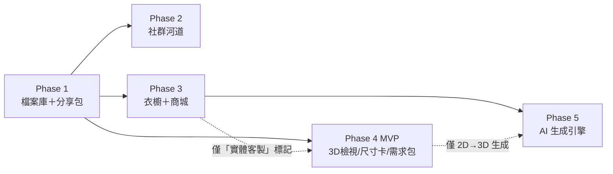
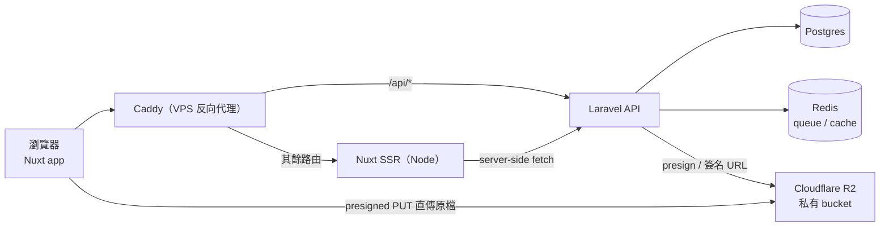

# SASD — Phase 1：獸設檔案庫與一鍵分享包

> PawFit（爪搭）系統分析與設計文件
> 版本 0.4（草稿）｜2026-10-07｜狀態：M1–M5 已實作，M6–M7 待 review
> 上游文件：`Pawfit (爪搭).md`｜下一份：`SASD-Phase2-社群與動態河道.md`
> 變更紀錄：0.2 依「AI 功能全部後移、社群優先」重排 phase 順序（社群 → Phase 2、衣櫥商城 → Phase 3、AI → Phase 5），本文件僅更新交叉引用，功能範圍不變。
> 0.3 新增 **委託需求單**（FR-6、`commission_kits` 表）：純模板、不含 AI；Phase 4 毛裝需求包沿用同一張表。
> 0.4 新增 **M6 開放與嵌入**（FR-7：oEmbed、SVG 色票卡、iframe 卡片、公開 JSON API v1，皆由用戶開關且預設關閉）；委託需求單改編號為 **M7**，M6 先做（帶來新用戶）。

---

## 0. 前置決策（已定案）

| 項目 | 決策 | 備註 |
|---|---|---|
| 平台 | Web-first（PWA 體驗） | NSFW UGC 與 App Store 審查根本衝突 |
| 架構 | 前後端分離：Nuxt 4 + TypeScript（SSR 前端）＋ Laravel（API 後端） | 2026-08-31 確認；monorepo：`apps/web` + `apps/api` |
| 部署 | 單一 VPS（Hetzner／DO）+ Docker Compose，Caddy 反向代理 | same-domain 路由：`/api/*` → Laravel，其餘 → Nuxt SSR（Node）——消滅 CORS 與跨域 cookie 問題 |
| DB／認證 | 自管 Postgres + Eloquent migrations；Socialite（Google OAuth）+ Sanctum（cookie auth） | Redis 供 queue／cache |
| 圖片儲存 | Cloudflare R2 私有 bucket（flysystem-aws-s3） | 零 egress 費；CF Images 明文禁成人內容，不可用 |
| 縮圖／壓縮／浮水印 | 後端 Laravel queue + Imagick（Intervention Image） | 前端只上傳原檔，衍生版本非同步產生 |
| UI | Tailwind CSS + Nuxt UI | 慣例預設 |
| 登入 | 僅 Google OAuth | Sign in with Apple 網頁版也需 US$99/年，延後 |
| NSFW | **第一天即支援** | 治理機制（年齡閘門、檢舉、後台）屬 Phase 1 必做 |
| 預算 | 月費 < US$25 | VPS $6–12 + R2 約 $1 + 網域 |

⚠️ 動工前 action：花十分鐘確認 VPS 供應商 AUP 與 Cloudflare（R2）服務條款對成人內容的現行規範。

### 0.1 全案上線策略：每個 phase 獨立部署、獨立啟用

各 phase 的依賴不是直線，而是以 Phase 1 為根的分支。所有 AI 功能集中在最後的 Phase 5，且沒有任何 phase 依賴它——最壞情況（AI 全滅、美術產能卡住）仍有 Phase 1、2、4 MVP 三個可獨立上線的產品：

優先序原則：**社群先於商城，AI 永遠最後**。理由：社群（Phase 2）技術風險最低、只依賴 Phase 1，且是留存與擴散的引擎；AI（Phase 5）品質風險與成本最不可控、獸圈對生成式 AI 高度敏感，必須等前面的產品站穩才評估。

三條全案工程原則，自 Phase 1 起生效：

1. **Feature flag——部署與啟用分離**：每個 phase 的功能以環境變數 flag 包裹（如 `FEATURE_FEED`、`FEATURE_WARDROBE`、`FEATURE_AI_CUTOUT`）。程式碼可先上 production 但功能關閉；啟用與回滾都只是改 flag，不需重新部署舊版。
2. **Migrations 全部 additive**：後續 phase 只加表、加欄位、加 enum 值（如 `visibility` 未來增列 `friends`），永不修改既有結構的語意；任何新 migration 跑完後，舊功能行為不變。
3. **ACL 單點原則**：所有內容可見性判斷（隱私 × NSFW × 未來的封鎖）收斂到單一判斷點——Laravel 端共用的 `canView()` service（Policy 統一掛載，`GET /api/img/:id` 與所有內容查詢一律經它）。前端與頁面層禁止自行實作可見性邏輯，Phase 2 啟用「限好友」與「封鎖」時只改這一點。

---

## 1. 系統分析（SA）

### 1.1 目標

讓獸圈用戶**集中管理獸設的設定資料**（多視角圖庫、精準色票、標籤），並以**一個連結**展示最完整的角色設定。定位：「更現代的 Toyhou.se 替代品」。

Phase 1 不含任何 AI 與換裝功能——這是獨立可上線、有真實價值的最小產品。

### 1.2 範圍

**In scope**

- Google 登入、Pawfit ID、個人主頁
- 多獸設建立與管理、色票、標籤
- 圖庫上傳（強制 2D／3D 模型／實體照片分類）、繪師標記（credit）
- 三段隱私、NSFW 標記與三段顯示偏好
- 一鍵分享包（網頁連結 + OG 預覽 + 浮水印）
- NSFW 治理：18+ 年齡聲明、檢舉、管理後台、服務條款
- 開放與嵌入（M6 延伸）：oEmbed、可貼進任何個人站的 SVG 色票卡與 iframe 卡片、公開資料 JSON API v1；由用戶逐一開關，預設關閉
- 委託需求單（M7 延伸）：由設定資料以模板產生委託描述文字＋參考圖合成圖，走分享連結交給繪師

**Out of scope（後續 phase 或延後）**

- 好友、發文與河道 → Phase 2
- 換裝衣櫥、商城 → Phase 3
- 3D 互動檢視、毛裝（實體）委託需求包 → Phase 4（Phase 1 的 3D 檔只是「上傳分類存放」；Phase 1 M7 只做 2D 繪圖委託）
- 所有 AI 功能（去背、拆件、轉正、2D→3D 生成、生成式換獸頭）→ Phase 5
- 委託描述文字的 LLM 潤飾：純文字、不碰繪圖，列為選配 flag（`FEATURE_BRIEF_LLM`），不綁任何 phase，M7 一律以模板輸出
- 個人存取權杖（以 API 讀自己的 unlisted／private 資料）、script 標籤式 widget、貼文嵌入 → backlog／Phase 2（見 FR-7.6）
- Apple 登入、PDF 匯出（分享連結已滿足核心需求，PDF 列 backlog）
- 「限好友」隱私（依賴 Phase 2 好友系統，見 1.5 FR-2.4 調整說明）

### 1.3 對應的 User Stories（節錄上游文件）

| # | User Story | 對應 FR |
|---|---|---|
| US-1 | 社群帳號快速註冊登入 | FR-1.1 |
| US-3 | 集中管理三視圖與精準色票，一個連結展示 | FR-2.2、FR-4.x |
| US-4 | 上傳委託成品、區分 2D/3D、私密收藏 | FR-3.x |
| US-5 | 標記原繪師／3D 製作者 | FR-3.3 |
| US-17 | 專屬標籤與圖檔隱私 | FR-2.3、FR-2.4、FR-3.5 |
| US-18 | NSFW 三段顯示設定 | FR-1.4、FR-1.5、FR-3.4 |

### 1.4 角色（Actors）

| 角色 | 說明 |
|---|---|
| 訪客 | 透過分享連結或公開主頁瀏覽，不可見 NSFW 內容 |
| 註冊用戶 | 完整功能：獸設管理、上傳、分享 |
| 管理員 | 站方（初期即開發者本人）：處理檢舉、下架、停權 |

### 1.5 功能需求（FR）

**FR-1 帳號與身分**

- FR-1.1 Google OAuth 一鍵註冊／登入（Socialite + Sanctum，same-domain cookie session）。
- FR-1.2 Pawfit ID：全站唯一，3–20 字元英數與底線，onboarding 時設定；更名政策見未決事項。
- FR-1.3 個人主頁 `/u/:pawfitId`：顯示名稱、頭像、代表獸設、公開獸設列表（＝展示畫廊雛形）。
- FR-1.4 NSFW 顯示偏好三段：`完全隱藏`（預設）／`防雷模糊`（點擊解鎖）／`直接顯示`。
- FR-1.5 18+ 年齡自我聲明：切換到「模糊」或「顯示」前強制完成，記錄聲明時間戳。
- FR-1.6 註冊時強制勾選服務條款與社群守則。

**FR-2 獸設檔案**

- FR-2.1 多獸設 CRUD；可指定一隻為代表獸設（顯示於個人主頁）。
- FR-2.2 色票管理：每筆含 hex 色碼、名稱、部位備註（如「腹毛」「內耳」），可排序；一鍵複製色碼。
- FR-2.3 標籤：獸設層級的全局標籤（如 `犬科`、`多肉`），Phase 2 發文時繼承用，Phase 1 先做管理與展示。
- FR-2.4 獸設隱私三段：`公開`／`連結可見（unlisted）`／`私人`。
  ⚠️ 調整說明：原文件的「限好友」依賴好友系統，Phase 2 啟用時在此欄位新增 `friends` 值即可，資料模型已預留。
- FR-2.5 獸設 NSFW 標記（設定圖本身即 NSFW 的情況）。

**FR-3 圖庫（專屬畫廊）**

- FR-3.1 圖片上傳：jpg/png/webp，單檔上限 20MB；前端以 presigned PUT 直傳原檔至 R2，後端 queue 以 Imagick 產出展示版（長邊 ≤2048）與縮圖（長邊 ≤512，webp），生成完成前該圖顯示「處理中」。
- FR-3.2 上傳時強制分類：`2D 平面作品`／`3D 模型`／`實體照片`（3D 模型此階段以圖片／截圖形式存放）。
- FR-3.3 創作者標記：自由文字名稱 + 選填連結（繪師個人頁），顯示於圖片詳情。
- FR-3.4 單圖 NSFW 標記：上傳時強制二選一（SFW／NSFW），不可略過。
- FR-3.5 單圖隱私：預設繼承獸設隱私，可單獨覆寫。
- FR-3.6 圖庫排序（拖曳）、圖片說明文字。

**FR-4 一鍵分享包**

- FR-4.1 對每個獸設產生分享連結 `/s/:slug`（nanoid），SSR 渲染 + OG meta（讓 Discord／Twitter 展開預覽卡）。
- FR-4.2 分享頁內容：角色名、簡介、標籤、色票、公開與連結可見的圖庫（NSFW 內容對訪客一律隱藏）。
- FR-4.3 浮水印開關：開啟時分享頁使用浮水印版圖檔（前端 canvas 產生後另存 R2）。
- FR-4.4 連結可停用與重新生成（舊 slug 立即失效）。

**FR-5 NSFW 治理與管理**

- FR-5.1 檢舉：登入用戶可對圖片／獸設／用戶提交檢舉（原因分類 + 補充說明）。
- FR-5.2 管理後台 `/admin`：檢舉佇列、內容預覽、下架（隱藏 + R2 物件保留供申訴）、停權帳號、操作紀錄。
- FR-5.3 非法內容緊急下架流程：管理員一鍵移除（DB 標記 removed + 立即撤銷簽名 URL 快取），紅線內容（如未成年相關）直接刪除 R2 物件並留存紀錄。
- FR-5.4 NSFW 顯示規則矩陣（全站一致執行）：

| 內容標記 | 訪客／未完成年齡聲明 | 偏好＝隱藏 | 偏好＝模糊 | 偏好＝顯示 |
|---|---|---|---|---|
| SFW | 顯示 | 顯示 | 顯示 | 顯示 |
| NSFW | 不顯示 | 不顯示 | 模糊＋點擊解鎖 | 直接顯示 |

（內容擁有者在自己的管理介面中一律可見自己的內容。）

**FR-6 委託需求單（M7 延伸；2D 繪圖委託）**

目的：玩家找繪師委託時，常要手動整理色票、特徵、參考圖與要求，再翻成英文貼到 DM。本功能把這件事變成一鍵。**全程不使用 AI 生圖**——拿 AI 產生的圖去委託繪師在圈內會被拒單甚至公開點名，與平台立場相違。

- FR-6.1 建立需求單：選擇獸設 → 勾選 1–10 張參考圖（需為本人圖庫、且 SFW 或需求單標記 NSFW）→ 填寫本次委託要求（構圖／情境／尺寸／用途／預算區間／截稿，皆選填）→ 產生需求單。
- FR-6.2 描述文字由**模板**從結構化資料產生：角色名、物種、簡介、特徵標籤、色票（名稱＋部位備註＋hex）、各參考圖的 caption 與繪師 credit、本次要求。輸出繁中與英文兩版（沿用 i18n 語言檔，新增語言零改碼），提供「複製純文字」按鈕（Discord／Twitter DM 友善的 Markdown 排版）。
- FR-6.3 範例圖＝**合成圖**：後端 queue 以 Imagick 將勾選的參考圖縮圖＋色票色卡（色塊＋hex＋部位）排版成一張 2048 寬的 webp 存 R2；每張參考圖下方印繪師 credit。不做任何生成或重繪。
- FR-6.4 需求單頁 `/c/:slug`：SSR＋OG meta（預覽卡用合成圖），內容＝描述文字（可切換語言）＋合成圖＋各參考圖原尺寸展示版（沿用 `GET /api/img/:id` ACL 與浮水印設定）。需求單為資料**快照**，之後修改獸設不影響既有需求單。
- FR-6.5 需求單隱私固定為 `unlisted`（知道連結即可看），可停用與重新生成，沿用 FR-4.4 語意；對訪客的 NSFW 處理沿用 FR-5.4 矩陣（需求單標記 NSFW 時整份對訪客不顯示，由玩家自行判斷是否交給繪師）。
- FR-6.6 不做：金流、繪師媒合、報價與履約（與 Phase 4 FR-4.3 同一長期定位——平台只做標準化資訊傳遞）。
- FR-6.7 LLM 潤飾（選配，`FEATURE_BRIEF_LLM`，預設關）：以模板輸出為基底讓純文字模型改寫語氣與翻譯，結果需用戶確認後才取代模板版；色票 hex 與 credit 欄位由程式鎖定不交給模型。

**FR-7 開放與嵌入（M6 延伸）**

目的：讓 Pawfit 成為獸設資料的**唯一來源**——Carrd、Toyhouse、個人站、GitHub README 都從這裡引用，而不是各自複製一份。全部功能只讀、只涉及公開資料、不含 AI。

- FR-7.1 用戶總開關 `profiles.allow_embed_api`（預設 **false**）：關閉時 FR-7.2–7.5 對該用戶所有資料一律回 404／不輸出 oEmbed；分享頁與 OG（FR-4）不受影響。另有獸設層級 `fursonas.allow_embed_api`（預設繼承用戶）可單獨關閉某隻。設計理由見 §2.4 第 6 點。
- FR-7.2 oEmbed：`GET /api/oembed?url=&format=json`（支援 `/s/:slug` 與 `/u/:pawfitId`，`type=rich`，回 FR-7.4 的 iframe HTML 與縮圖），分享頁與個人主頁 `<head>` 加 discovery link。個人主頁 OG 圖補為代表獸設的首張公開 SFW 圖（無則站方預設圖）。
- FR-7.3 SVG 色票卡 `GET /embed/:slug/palette.svg?theme=light|dark&layout=row|grid`：純靜態 SVG（色塊、名稱、部位、hex、角色名、Pawfit 小標），server 端渲染並快取 10 分鐘，`Content-Type: image/svg+xml`，無 script、無外部資源，可直接貼進 Markdown 與任何 ``。
- FR-7.4 iframe 卡片 `GET /embed/:slug?theme=light|dark|auto&size=sm|md|lg`：SSR 頁，內容＝頭像、名字、物種、簡介前 140 字、色票、前 4 張公開 SFW 圖（走 `/api/img/:id`，尊重浮水印設定）、「在 Pawfit 查看」連結。嵌入情境觀看者**永遠視同訪客**（FR-5.4 矩陣第一欄），NSFW 一律不出現。`/embed/*` 回應 `Content-Security-Policy: frame-ancestors *`，其餘所有路由維持 `frame-ancestors 'self'`。頁內無 cookie、無登入狀態，`Referrer-Policy: strict-origin`。
- FR-7.5 公開 JSON API v1（匿名、GET only）：
  - `GET /api/v1/public/users/:pawfitId`：顯示名稱、頭像圖片路徑、代表獸設 slug、公開獸設列表（名稱、物種、標籤、分享 slug）。
  - `GET /api/v1/public/fursonas/:slug`：名稱、物種、簡介、標籤、色票、`is_nsfw`、繪師 credit 列表；`:slug` 為分享連結 slug，故 `unlisted` 獸設「知道 slug 即可讀」，與分享頁語意一致；`private` 一律 404。
  - `GET /api/v1/public/fursonas/:slug/media?cursor=`：公開 SFW 圖的 `kind`、`caption`、`credit`、尺寸、`url`（＝`/api/img/:id` 路徑，**不給 R2 直鏈**）。
  - 回應固定 `Cache-Control: public, max-age=300`、開放 CORS（僅 GET）、以 IP 做 rate limit（建議 60 req/min），版號寫在路徑，v1 欄位只增不刪；用戶與獸設的 `allow_embed_api` 任一為 false → 404。
- FR-7.6 不做：script 標籤式 widget（跨站注入 JS 的安全與維護成本不值得，iframe 已足夠）、寫入 API、個人存取權杖讀取 unlisted／private 資料（列 backlog，等有真實需求）、貼文嵌入（Phase 2 河道上線後沿用同一套 `/embed` 與 oEmbed 機制增列 post 類型）。
- FR-7.7 反爬取與 AI 訓練防護：`/embed/*`、`/api/v1/public/*`、分享頁與個人主頁一律回 `X-Robots-Tag: noai, noimageai` 並在 `<head>` 加對應 meta；`robots.txt` 封鎖已知 AI 爬蟲 UA；ToS 增補「禁止將本站資料用於訓練機器學習模型」；API 回應帶 `X-Pawfit-Terms` 指向該條款。

### 1.6 非功能需求（NFR）

- **成本**：月費 < US$25；R2 零 egress 費是圖片站的關鍵前提。
- **隱私安全**：`私人`與`unlisted` 圖檔絕不可被未授權存取——R2 全私有，一律經簽名 URL；授權判斷集中於 `canView()`（§0.1 原則 3）。
- **效能**：分享頁與個人主頁 SSR，LCP < 2.5s（縮圖 webp + CDN 快取）。
- **SEO／分享體驗**：公開頁面完整 OG/Twitter meta。
- **法遵**：18+ 聲明與 ToS 同意皆記錄時間戳；隱私權政策頁。

---

## 2. 系統設計（SD）

### 2.1 系統架構

**上傳流程**：前端選檔 → `POST /api/media/presign`（驗證登入與配額）→ 原檔直傳 R2 → `POST /api/media/confirm` 寫入 DB（status=processing）→ queue job 取原檔以 Imagick 產展示版／縮圖回存 R2 → status=active。
**讀取流程**：`GET /api/img/:mediaId?v=thumb|display|original` → `canView()` 檢查（隱私 × NSFW 矩陣）→ 302 導向短效簽名 URL。公開內容的縮圖可設較長 CDN 快取。

### 2.2 資料模型

資料表以 Laravel migrations 建立。`profiles` 即 Laravel 慣例的 `users` 表（下表沿用 profiles 名稱描述業務欄位），另含 `google_id`、`email` 等認證欄位。

**profiles**

| 欄位 | 型別 | 說明 |
|---|---|---|
| id | uuid PK | 另有 google_id UNIQUE、email 等認證欄位 |
| pawfit_id | text UNIQUE | 3–20 英數底線 |
| display_name | text | |
| avatar_media_id | uuid FK→media | 可空 |
| nsfw_pref | enum: hide/blur/show | 預設 hide |
| adult_confirmed_at | timestamptz | 18+ 聲明時間，可空 |
| tos_accepted_at | timestamptz | |
| is_banned | boolean | 預設 false |
| allow_embed_api | boolean | 預設 false（FR-7.1 總開關） |
| created_at | timestamptz | |

**fursonas**

| 欄位 | 型別 | 說明 |
|---|---|---|
| id | uuid PK | |
| owner_id | uuid FK→profiles | |
| name / species / bio | text | |
| tags | text[] | 母標籤 |
| palette | jsonb | `[{hex, name, note, sort}]` |
| visibility | enum: public/unlisted/private | Phase 2 增列 friends |
| is_nsfw | boolean | |
| is_representative | boolean | 每用戶至多一筆 true（partial unique index） |
| allow_embed_api | boolean，可空 | 空＝繼承用戶設定（FR-7.1） |
| created_at / updated_at | timestamptz | |

**media**

| 欄位 | 型別 | 說明 |
|---|---|---|
| id | uuid PK | |
| fursona_id | uuid FK→fursonas | |
| owner_id | uuid FK→profiles | 反正規化，方便授權查詢 |
| kind | enum: art2d/model3d/photo | 強制分類 |
| storage_key / display_key / thumb_key | text | R2 object keys |
| watermarked_key | text | 可空，開浮水印時生成 |
| width / height / bytes | int | 展示版尺寸 |
| credit_name / credit_url | text | 繪師標記 |
| is_nsfw | boolean | 上傳時強制選擇 |
| visibility_override | enum，可空 | 空＝繼承獸設 |
| caption | text | |
| sort_order | int | |
| status | enum: processing/active/removed | processing＝衍生檔生成中；removed＝管理員下架 |
| created_at | timestamptz | |

**share_links**

| 欄位 | 型別 | 說明 |
|---|---|---|
| id | uuid PK | |
| fursona_id | uuid FK | |
| slug | text UNIQUE | nanoid(10) |
| watermark | boolean | |
| revoked_at | timestamptz | 可空 |
| created_at | timestamptz | |

**commission_kits**（M7；Phase 4 毛裝需求包沿用同表，以 `kind` 區分）

| 欄位 | 型別 | 說明 |
|---|---|---|
| id | uuid PK | |
| fursona_id | uuid FK→fursonas | |
| owner_id | uuid FK→profiles | 反正規化 |
| kind | enum: art2d/fursuit | Phase 1 只有 art2d；Phase 4 增列 fursuit |
| slug | text UNIQUE | nanoid(10)，頁面 `/c/:slug` |
| snapshot | jsonb | 建立當下的角色資料快照：name/species/bio/tags/palette、參考圖 caption 與 credit、本次要求欄位 |
| media_ids | uuid[] | 參考圖（1–10） |
| brief_text | jsonb | `{zh-TW: text, en: text}`，模板產生；LLM 潤飾後覆寫並記 `brief_source=llm` |
| brief_source | enum: template/llm | 預設 template |
| sheet_key | text | 合成圖 R2 key，可空（queue 生成中） |
| is_nsfw | boolean | 任一參考圖 NSFW 則鎖定 true |
| size_card_id / pin_set | uuid FK, jsonb | 可空；Phase 4 `fursuit` 才使用 |
| status | enum: processing/active/revoked | processing＝合成圖生成中 |
| revoked_at | timestamptz | 可空 |
| created_at | timestamptz | |

**reports**

| 欄位 | 型別 | 說明 |
|---|---|---|
| id | uuid PK | |
| reporter_id | uuid FK | |
| target_type | enum: media/fursona/profile | |
| target_id | uuid | |
| reason_code | enum: illegal/untagged_nsfw/copyright/harassment/other | |
| detail | text | |
| status | enum: open/resolved/dismissed | |
| resolved_by / resolved_at | | |
| created_at | timestamptz | |

**admin_actions**（稽核紀錄）

| 欄位 | 型別 |
|---|---|
| id / admin_id / action / target_type / target_id / note / created_at | |

**授權原則**：一律經 Laravel Policy＋`canView()` service——owner 對自有資料全權限；`visibility=public` 且 `status=active` 開放匿名讀；`unlisted` 由 controller 驗 slug 後代查；admin 走獨立 Gate（環境變數名單）。

### 2.3 API 設計（Laravel `routes/api.php`）

| Method + Path | 說明 |
|---|---|
| `GET/POST /api/fursonas`、`GET/PATCH/DELETE /api/fursonas/:id` | 獸設 CRUD |
| `POST /api/media/presign` | 驗證後回原檔 presigned PUT URL |
| `POST /api/media/confirm`、`PATCH/DELETE /api/media/:id` | 寫入／更新／刪除（含 R2 清理） |
| `GET /api/img/:id` | ACL 檢查 → 302 簽名 URL |
| `POST /api/share-links`、`DELETE /api/share-links/:id` | 分享連結管理 |
| `GET /api/oembed?url=` | oEmbed（M6，FR-7.2） |
| `GET /api/v1/public/users/:pawfitId`、`GET /api/v1/public/fursonas/:slug`、`GET /api/v1/public/fursonas/:slug/media` | 公開 JSON API v1（M6，FR-7.5；匿名、GET only、IP rate limit） |
| `GET/POST /api/commission-kits`、`GET/DELETE /api/commission-kits/:id`、`POST /api/commission-kits/:id/regenerate` | 委託需求單（M7）；regenerate＝換 slug 並重跑合成圖 |
| `POST /api/commission-kits/:id/polish` | LLM 潤飾（`FEATURE_BRIEF_LLM` 開啟時才註冊路由） |
| `POST /api/reports` | 檢舉 |
| `GET /api/admin/reports`、`POST /api/admin/actions` | 管理後台（server 端驗 admin 名單） |

頁面路由：`/`（landing）、`/login`、`/onboarding`、`/dashboard`、`/fursona/:id`（編輯器：圖庫/色票/標籤/隱私/委託分頁）、`/u/:pawfitId`、`/s/:slug`、`/embed/:slug` 與 `/embed/:slug/palette.svg`（嵌入，M6）、`/c/:slug`（委託需求單，M7）、`/settings`（新增「開放與嵌入」分頁：總開關、各獸設開關、嵌入程式碼產生器）、`/admin`。

### 2.4 關鍵設計決策

1. **三版檔案策略**：保留原檔（收藏庫價值）＋展示版＋縮圖。儲存成本估算：1000 用戶 × 平均 30 圖 × ~3MB ≈ 90GB ≈ US$1.35/月（R2 $0.015/GB），可控。
2. **浮水印實作**：開啟時後端 queue 以展示版壓字產生第四版存 R2；不做「CSS overlay + 防右鍵」這種弱防護。
3. **簽名 URL TTL**：私有內容 15 分鐘；公開縮圖走可快取路徑減少後端請求數。
4. **`unlisted` 的語意**：知道連結即可看，不出現在任何公開列表與搜尋；分享頁對訪客隱藏 NSFW（訪客無從完成年齡聲明）。
5. **委託需求單是快照、不是即時視圖**（M7）：繪師拿到的內容必須與玩家送出當下一致，之後改色票不應讓進行中的委託變動；需求單與分享包（`/s/:slug`）因此是兩套物件，不互相引用。`commission_kits` 一開始就帶 `kind` 與 `size_card_id/pin_set` 欄位，Phase 4 毛裝需求包只做 additive migration。
6. **嵌入與 API 預設關閉、由用戶自己打開**（M6）：公開 JSON API 等於把全站設定圖整理好給爬蟲，獸圈對此極度敏感（Toyhouse 預設全私密即為此）。Opt-in 讓「被引用」成為用戶的主動選擇，與 Phase 5「AI 產物可被篩選」是同一種尊重。代價是初期嵌入數量較少，可接受。
7. **嵌入只做 iframe 與靜態 SVG**（M6）：兩者都不在第三方頁面執行我們的 JS，沒有 XSS 擴散面；SVG 色票卡更是零 JS 的純圖片，GitHub README 也能貼。

### 2.5 安全設計摘要

- 可見性判斷集中於 `canView()` service 與 Policy（見 §0.1 原則 3），前端與頁面層禁止自行判斷。
- R2 憑證與各服務金鑰僅存在後端 `.env`，前端 bundle 內不得有任何秘密。
- Postgres 每日自動備份上傳至獨立 R2 bucket；還原流程至少實際演練一次。
- 上傳配額：單用戶總容量與單日上傳數限制（防濫用，值待定，建議 2GB／50 張起步）。
- 基本 rate limit：presign 與 reports 路由。
- admin 名單以環境變數維護（初期一人）。
- 嵌入（M6）：只有 `/embed/*` 允許被跨站 iframe，其餘路由 `frame-ancestors 'self'`；嵌入頁不設 cookie、不帶登入狀態，避免點擊劫持與狀態外洩。公開 API 與嵌入頁走 IP rate limit 與 `noai` 標頭（FR-7.7）。

---

## 3. 風險與未決事項

| # | 事項 | 說明 |
|---|---|---|
| R-1 | 供應商 ToS | 動工前確認 VPS 供應商／Cloudflare（R2）現行條款（見 §0） |
| R-2 | pawfit_id 更名政策 | 建議：可改一次，舊 ID 保留 90 天轉址 → 待拍板 |
| R-3 | 原檔儲存成本 | 已估算可控；若失控可改為「僅付費用戶保留原檔」 |
| R-4 | 檢舉是否開放未登入 | 暫定僅登入用戶；分享頁提供 mailto 通報管道 |
| R-5 | 授權議題 | 上傳委託作品的授權聲明文字（ToS 內）需在上線前定稿 |
| R-6 | 公開 API 與嵌入成為爬蟲／AI 訓練的集中入口（M6） | 預設關閉、用戶 opt-in；IP rate limit；`noai`／`noimageai` 標頭與 robots 封鎖；圖片只給 ACL 路徑不給直鏈；ToS 明訂禁止訓練用途 |
| R-7 | 嵌入頁被用於點擊劫持或洩漏登入狀態（M6） | 只有 `/embed/*` 可被跨站 iframe；嵌入頁無 cookie、無登入狀態、無任何寫入操作 |

## 4. 里程碑與驗收

- **M1 骨架**：VPS + Docker Compose 部署管線通（Caddy／Nuxt SSR／Laravel／Postgres／Redis）、Google 登入、onboarding（Pawfit ID + ToS）。
- **M2 獸設核心**：獸設 CRUD、色票、標籤、隱私；個人主頁。
- **M3 圖庫**：三版上傳管線、分類、credit、單圖隱私與 NSFW 標記、ACL 圖片路由。
- **M4 分享包**：分享頁 SSR + OG、浮水印、連結管理。
- **M5 治理**：年齡閘門、NSFW 矩陣全站生效、檢舉、管理後台、ToS/守則頁。
- **M6 開放與嵌入**（延伸，排在 Phase 2 之前；先於 M7，因為它帶來新用戶）：`allow_embed_api` 開關與設定頁、oEmbed 與主頁 OG 補圖、SVG 色票卡、iframe 卡片與 CSP、公開 JSON API v1 與 rate limit、`noai` 標頭與 ToS 增補。驗收：用戶打開開關後，把色票卡貼進 GitHub README 與 Carrd 都正確顯示；iframe 卡片在深色個人站用 `theme=auto` 正常；關閉開關後 API、嵌入與 oEmbed 全部 404 但分享頁仍可用；未開啟的用戶從外部完全讀不到。
- **M7 委託需求單**（延伸，M6 之後）：建立／停用／重新生成、模板雙語文字、合成圖 queue、`/c/:slug` SSR＋OG。驗收：玩家 3 分鐘內產出一份需求單，貼到 Discord 有正確預覽卡，繪師不登入即可看到色票 hex、所有參考圖與 credit；LLM 潤飾 flag 預設關閉。

**Phase 1 完成定義（DoD）**：一位新用戶可以在 10 分鐘內——Google 登入 → 建立獸設 → 上傳 5 張圖（含 1 張 NSFW）→ 設定色票 → 產生分享連結，貼到 Discord 有正確預覽卡；且訪客開啟連結看不到任何 NSFW 內容。
